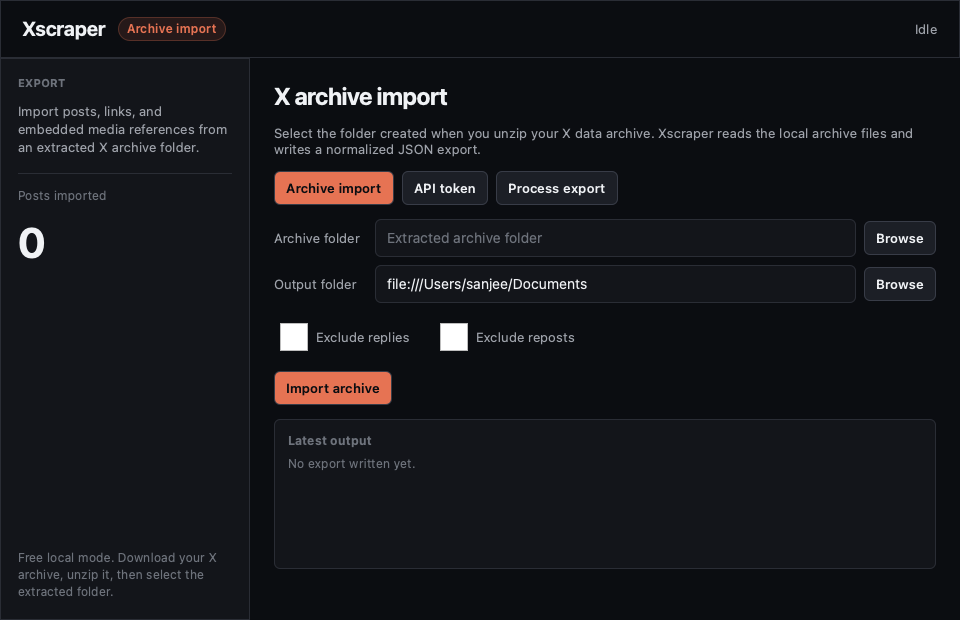
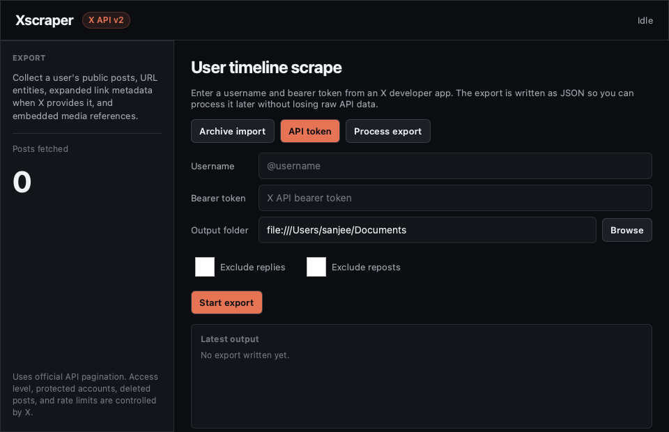
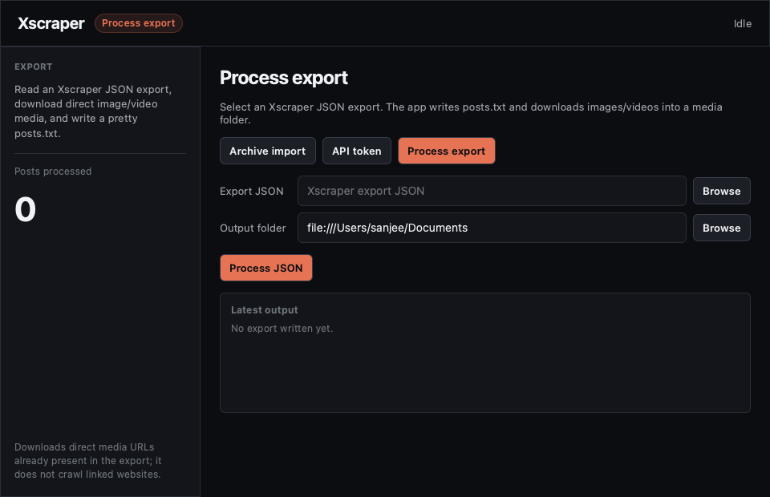

# Xscraper

Small Qt Quick app for exporting X/Twitter posts to JSON.

## Screenshots

### Archive import



### API token



### Process export



## License

Xscraper is licensed under the MIT License. See [LICENSE](LICENSE).

The release bundles Qt runtime frameworks. Qt is available under commercial
and open-source licenses; this project uses dynamically linked Qt frameworks
under the open-source LGPLv3 path for the Qt modules it depends on. See
[THIRD_PARTY_NOTICES.md](THIRD_PARTY_NOTICES.md) and
[LICENSES/LGPL-3.0-only.txt](LICENSES/LGPL-3.0-only.txt).

The app has three modes:

- `Archive import`: free local import from an extracted X data archive.
- `API token`: official X API v2 user posts timeline export.
- `Process export`: read an Xscraper JSON export, download direct media, and
  write a pretty `posts.txt`.

Archive import and API token modes write:

- post text and structured post fields
- URL entities as `linked_content`
- embedded media references when present
- raw source records for later reprocessing

API token mode also writes the resolved user profile and expanded API includes
for media, users, places, and polls. Archive import writes the account metadata
found in the archive and preserves each raw archive tweet.

Archive import does not call X at all. API token mode does not use private web
endpoints or bypass account protections. Protected accounts, deleted posts, rate
limits, historical access, and paid-tier limits are controlled by X.

Process export mode reads the JSON created by either export mode. It downloads
direct media URLs that are already present in the export, such as X image URLs
and MP4 video variants. It does not crawl arbitrary linked websites.

## Build

This project follows the CMake/Qt Quick layout used by `ceres`.

```sh
cmake -S . -B build
cmake --build build
```

This machine currently has `qmake` but no `cmake` on `PATH`, so a qmake wrapper is also
included:

```sh
mkdir -p build-qmake
qmake xscraper.pro -o build-qmake/Makefile
make -C build-qmake -j4
open build-qmake/xscraper.app
```

## Release

GitHub Actions builds a macOS package when you push a tag beginning with `v`.

```sh
git tag v0.1.0
git push origin v0.1.0
```

The release workflow creates:

- `xscraper-macos.zip`
- `xscraper-macos.dmg`

You can also run the release workflow manually from the GitHub Actions tab.

## Run

### Free mode: import an X archive

1. Request your X data archive from X.
2. Download the archive when X notifies you that it is ready.
3. Unzip the archive.
4. Launch Xscraper.
5. Select `Archive import`.
6. Choose the extracted archive folder. This is usually the folder containing a
   `data` directory and files like `Your archive.html`.
7. Choose an output folder.
8. Click `Import archive`.

Xscraper reads local JavaScript data files such as `data/tweets.js` or tweet
part files, normalizes each tweet record, extracts URL entities into
`linked_content`, extracts media references into `embedded_media`, and preserves
the raw archive tweet as `raw_archive_tweet`.

### API mode

1. Create an X developer app and get a bearer token.
2. Launch Xscraper.
3. Select `API token`.
4. Enter a username, bearer token, and export folder.
5. Leave `Exclude replies` and `Exclude reposts` unchecked if you want the
   largest possible post export.
6. Click `Start export`.

The output file is named like `username_20260621T123456Z.json`.

X's User Posts timeline supports pagination for up to the most recent 3,200
posts that the endpoint and your access tier can return. If an API run returns
fewer posts than expected, check:

- `Exclude replies` and `Exclude reposts` were not checked.
- The exported JSON `filters` object says both values are `false`.
- The account's missing posts are not older than X's accessible window for your
  API access.
- The app did not stop with a billing or permission error.

When X returns an HTTP 429 rate-limit response, Xscraper waits for the
`Retry-After` or `x-rate-limit-reset` time and retries the same page. During
that wait the status line will say it is rate limited and show how long it will
wait. Leave the app open if you want it to continue automatically.

### Process an export

After API mode or archive import creates a JSON file:

1. Select `Process export`.
2. Choose the Xscraper `.json` export file.
3. Choose an output folder.
4. Click `Process JSON`.

Xscraper writes:

- `posts.txt`: a readable text file with post number, date, ID, URL, text,
  linked URLs, and media references.
- `media/`: downloaded images and videos found in the export.

Media files are named from the post ID, for example:

```text
media/1930000000000000000_01.jpg
media/1930000000000000000_02.mp4
```

For API exports, media comes from `includes.media` and post
`attachments.media_keys`. For archive imports, media comes from each post's
`embedded_media` section.

## Download your X archive

X's current Help Center path is `Settings and privacy` -> `Your account` ->
`Download an archive of your data`.

### Request from X.com in a browser

1. Open <https://x.com> and sign in.
2. In the left navigation, click `More`.
3. Click `Settings and privacy`.
4. Click `Your account`.
5. Click `Download an archive of your data`.
6. Re-enter your password if X asks.
7. Complete any email, SMS, authenticator, or two-factor challenge.
8. Click `Request archive`.

### Request from the iOS or Android app

1. Open the X app and sign in.
2. Tap your profile icon.
3. Tap `Settings and privacy`.
   In some app versions this is under `Settings & Support`.
4. Tap `Your account`.
5. Tap `Download an archive of your data`.
6. Re-enter your password if X asks.
7. Complete any email, SMS, authenticator, or two-factor challenge.
8. Tap `Request archive`.

### Download and unzip the archive

1. Wait for X to prepare the archive.
   X says you will receive an email and/or in-app notification when it is ready.
2. Return to the same page:
   `Settings and privacy` -> `Your account` -> `Download an archive of your data`.
3. Click or tap the available archive download.
4. Download the `.zip` file.
5. Unzip it locally.
6. In Xscraper, choose the extracted folder, not the `.zip` file.

The folder you select in Xscraper should usually contain:

- `Your archive.html`
- a `data` folder
- files inside `data` such as `account.js`, `tweets.js`, or tweet part files

The archive can be large, especially if your account has many posts or media
attachments. Xscraper currently reads the archive after it has been unzipped.

Official X Help Center reference:

- [How to access and download your X data](https://help.x.com/en/managing-your-account/accessing-your-x-data)

## Get an X API bearer token

Xscraper needs an app-only Bearer Token. This is the X credential intended for
read-only public-data requests, such as looking up a user and reading public
posts.

1. Go to the X Developer Console at <https://console.x.com>.
2. Sign in with the X account you want to use for developer access.
3. Create or finish setting up a developer account.
   You may need to accept the Developer Agreement, complete your developer
   profile, describe your API use case, and set up billing or credits depending
   on X's current access rules.
4. Create a Project/App.
   In the console, choose `New App` or create an app inside a project. Give it a
   name and description. A simple use case for this app is: exporting public
   posts for personal archival or analysis.
5. Open the app's `Keys and tokens` page.
6. Copy the `Bearer Token`.
   Save it immediately in a password manager. X's docs note that credentials may
   only be shown once; if you lose one, regenerate it, which invalidates the old
   token.
7. Paste the Bearer Token into Xscraper's `Bearer token` field.

You do not need OAuth callback URLs or user-login OAuth for the current
Xscraper flow. The app only reads public timeline data through app-only
authentication.

### Test the token

Before using the token in Xscraper, you can test it from a terminal:

```sh
export BEARER_TOKEN='paste-your-token-here'

curl "https://api.x.com/2/users/by/username/xdevelopers" \
  -H "Authorization: Bearer $BEARER_TOKEN"
```

If the token works, X returns a JSON object with user data. If you see
`Unauthorized`, `Forbidden`, or a billing/access error, check that:

- the token was copied without spaces or quotes
- the app is attached to an active developer project
- your project has access to the user lookup and user posts timeline endpoints
- your X API credits, billing, or rate limits are not exhausted

### Security notes

- Treat the Bearer Token like a password.
- Do not commit it to git, paste it into issues, or share screenshots containing
  it.
- Regenerate the token in the Developer Console if it is exposed.
- Xscraper currently keeps the token only in the running UI field; it does not
  write the token into the JSON export.

Official docs:

- [Getting Access](https://docs.x.com/x-api/getting-started/getting-access)
- [Bearer Tokens](https://docs.x.com/fundamentals/authentication/oauth-2-0/bearer-tokens)
- [Developer Console](https://docs.x.com/fundamentals/developer-portal)
